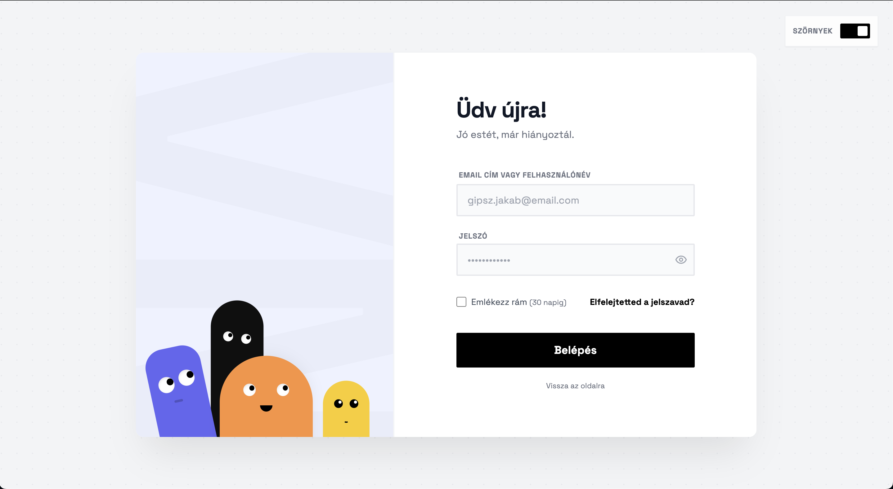
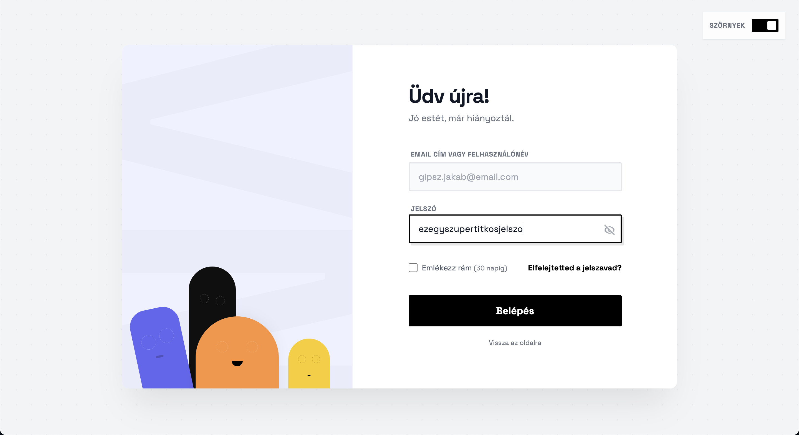
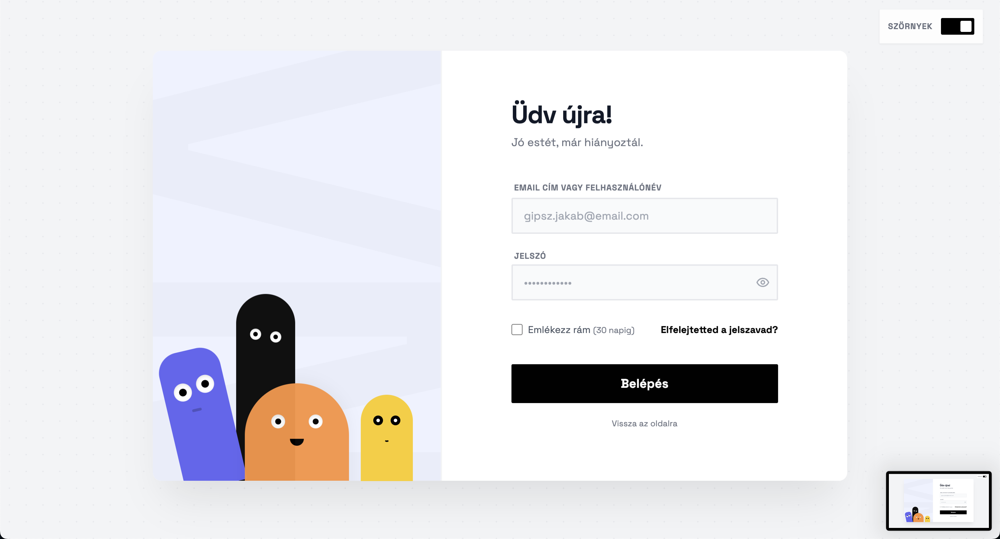

# 👾 Monster Login - Interaktív Bejelentkezési Oldal

Egy modern, játékos és interaktív login oldal aranyos szörnyecskékkel, amelyek követik a kurzort és reagálnak a felhasználói interakciókra.



## ✨ Funkciók

### 🎨 Interaktív Szörnyecskék
- **4 egyedi szörnyecske karakterrel** különböző színekben (fekete, lila, sárga, narancs)
- **Egér-követés**: A szörnyek szemei követik a kurzor mozgását a képernyőn
- **Testmozgás**: A szörnyek teste is finoman reagál az egér pozíciójára, különböző sebességekkel
- **Rázó animáció**: Hibás bejelentkezés esetén a szörnyek fejüket rázva jelzik a problémát
- **Pislogás effekt**: Amikor a jelszót láthatóvá teszed, a szörnyek "lecsukják szemüket"



### 🕐 Dinamikus Köszöntések
Az oldal automatikusan felismeri a napszakot és személyre szabott üdvözlő üzenettel fogad:



- **06:00-10:00**: "Jó reggelt, már hiányoztál."
- **10:00-12:00**: "Jó napot, már hiányoztál."
- **12:00-17:00**: "Jó délutánt, már hiányoztál."
- **17:00-06:00**: "Jó estét, már hiányoztál."

### 🎯 Modern UI/UX Elemek
- **Animált háttér**: Pontmintás, pulzáló háttér folyamatos mozgással
- **Sharp Design stílus**: Éles sarkok, kontrasztos árnyékok és box-shadow effektek
- **Responsive design**: Tökéletesen működik mobilon és asztali gépen
- **Toast értesítések**: Modern értesítési rendszer
- **Jelszó láthatóság kapcsoló**: Szem ikon a jelszó megjelenítéséhez/elrejtéséhez
- **Smooth animációk**: Spring animációk a szörnyek megjelenésekor
- **Form validáció**: Vizuális visszajelzés hibás adatok esetén

### 🔐 Funkcionális Elemek
- Email/felhasználónév bejelentkezés
- "Emlékezz rám" funkció (30 napig)
- Elfelejtett jelszó link
- Protected routing - Admin oldal védett útvonallal
- LocalStorage alapú session kezelés
- Sikeres bejelentkezés vizuális visszajelzése

## 🛠️ Technológiai Stack

- **React 18** - Modern React hooks és komponensek
- **TypeScript** - Típusbiztonság
- **Vite** - Gyors fejlesztői környezet
- **Tailwind CSS** - Utility-first CSS framework
- **React Router** - Routing és navigáció
- **Lucide React** - Modern ikonkészlet
- **Custom CSS Animations** - Egyedi animációk és effektek

## 📦 Projekt Struktúra

```
login/
├── components/
│   ├── login/
│   │   ├── LoginForm.tsx       # Bejelentkezési form komponens
│   │   └── MonsterPanel.tsx    # Interaktív szörnyecskék panel
│   └── ui/
│       └── ToastContainer.tsx  # Toast értesítések
├── contexts/
│   └── ToastContext.tsx        # Toast context provider
├── pages/
│   ├── AdminPage.tsx           # Protected admin oldal
│   ├── HomePage.tsx            # Főoldal
│   └── LoginPage.tsx           # Login oldal
├── styles/
│   └── global.css              # Globális stílusok és animációk
├── utils/
│   └── greetings.ts            # Időfüggő köszöntések
└── constants.ts                # Konstansok és szövegek
```

## 🚀 Telepítés és Futtatás

### Előfeltételek
- Node.js (v16 vagy újabb)
- npm vagy yarn

### Lépések

1. **Függőségek telepítése**
```bash
npm install
```

2. **Fejlesztői szerver indítása**
```bash
npm run dev
```

3. **Böngésző megnyitása**
```
http://localhost:3000
```

### További parancsok

```bash
# Production build készítése
npm run build

# Build előnézet
npm run preview

# TypeScript típusellenőrzés
npm run type-check

# Linting
npm run lint
```

## 🎮 Használat

1. **Belépés**: Írj be bármilyen email címet és jelszót
2. **Figyelj a szörnykékre**: Mozgasd az egeret és nézd, ahogy követnek!
3. **Jelszó láthatóság**: Kattints a szem ikonra, hogy lássad mi történik
4. **Hibás adatok**: Próbálj meg üresen beküldeni a formot a rázó animációért
5. **Sikeres belépés**: A gomb zöldre vált és átirányít az admin oldalra

## 🎨 Testreszabás

### Szövegek módosítása
A `constants.ts` fájlban találhatók az összes szöveg és szövegkonstans:
```typescript
export const TEXT_CONTENT = {
  LOGIN_TITLE: "Üdv újra!",
  EMAIL_LABEL: "Email cím vagy Felhasználónév",
  // ...
}
```

### Animációk sebessége
A `constants.ts` fájlban állíthatók az animáció időzítések:
```typescript
export const ANIMATION_DELAYS = {
  MONSTER_SHAKE_STAGGER_MS: 60,
  LOGIN_SUCCESS_ALERT_MS: 100
}
```

### Szörnyecskék kinézete
A `global.css` fájlban módosíthatók a szörnyek stílusai:
- `.m-black` - Fekete szörny
- `.m-purple` - Lila szörny
- `.m-yellow` - Sárga szörny
- `.m-orange` - Narancs szörny

## 🌟 Kiemelkedő Jellemzők

- **Mikro-interakciók**: Minden kattintás, hover és input változás vizuális visszajelzéssel bír
- **Performancia**: Optimalizált animációk és smooth 60fps élmény
- **Hozzáférhetőség**: Megfelelő label-ek, focus állapotok
- **Mobil-barát**: A desktop-on látható szörnyek elrejtése mobilon a jobb UX érdekében
- **Árnyékok és mélység**: Neomorf és sharp design elemek kombinációja

## 📸 Képernyőképek

### Főképernyő
A bejelentkezési oldal 4 aranyos szörnnyel, amelyek interaktívan reagálnak az egér mozgására.


### Dinamikus napszakos köszöntések
Az oldal automatikusan érzékeli a napszakot (reggel, délelőtt, délután, este) és személyre szabott üdvözléssel fogad.


### Jelszó elrejtése - Szörnyek "lecsukják szemüket"
Amikor a jelszó láthatóvá válik, a szörnyek szemhéja lecsukódik, mintha nem akarnának leskelődni!


## 📝 Licenc

MIT

## 👨‍💻 Készítette

**Vajda Norman** - 2025

---

*Enjoy the monsters! 👾*
